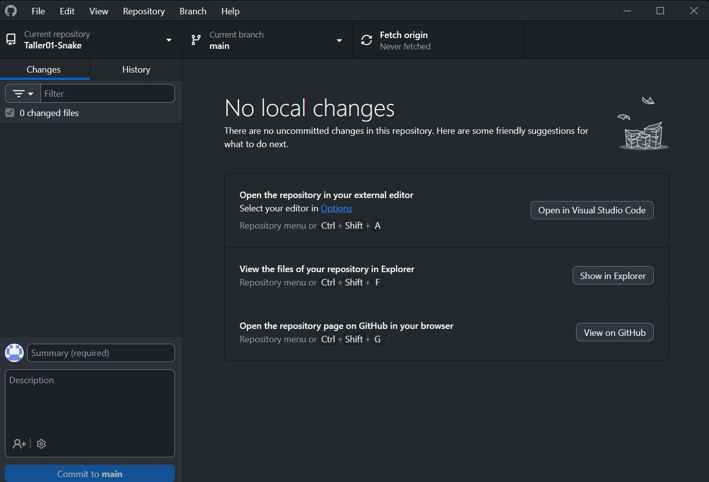
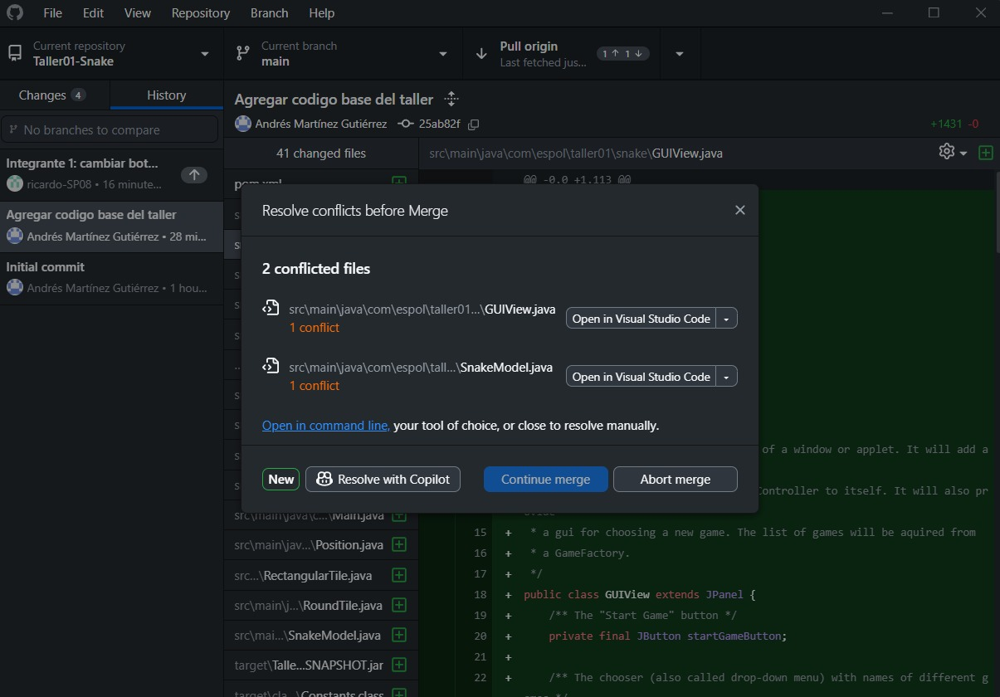
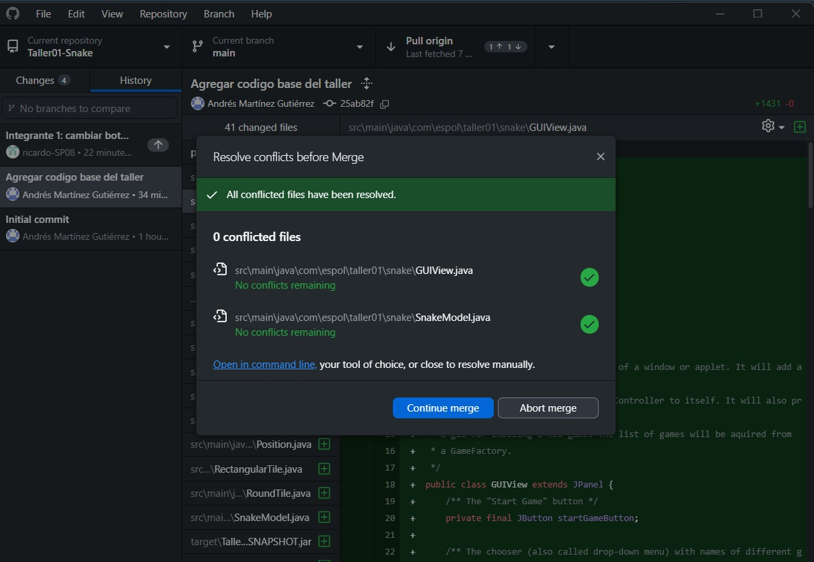
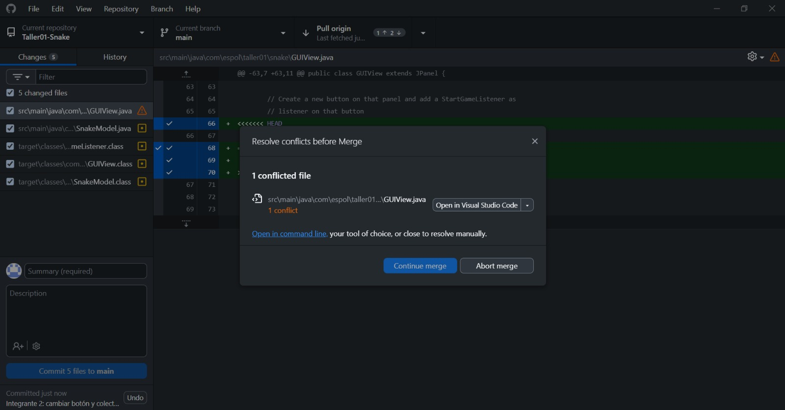
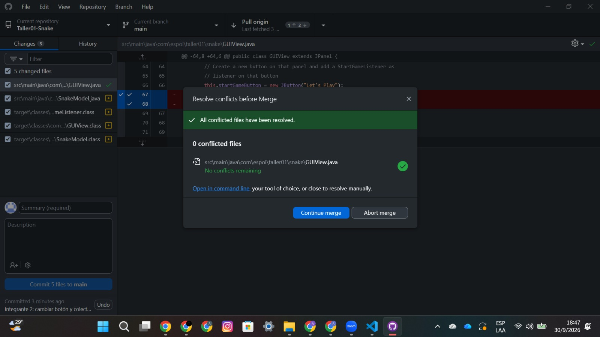

# Taller01-Snake
| Rol | Nombre | Usuario de GitHub | Commit principal |
| --- | --- | --- | --- |
| Líder | Jorge Martínez|andres75125| personalizar botón y colores principales |
| Integrante 1 | Ricardo Soledispa |ricardo-SP08 | cambiar botón y cabeza de snake |
| Integrante 2 | Jorge Martínez | ndres75125 | personalizar botón y colores principales |
| Integrante 3 |  |  |  |
| Integrante 4 |  |  |  |

Push exitoso inicial:

### Integrante 1

Error antes de resolver conflicto:

Push exitoso después de resolver conflicto:

### Integrante 2

Error antes de resolver conflicto:

Push exitoso después de resolver conflicto:

